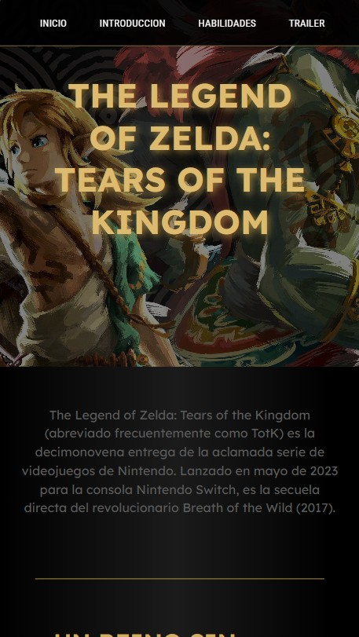

# 🗡️ Blog *Zelda: Tears of the Kingdom*
## 🎈Resumen
Este proyecto es un blog temático dedicado a la legendaria franquicia de videojuegos The Legend of Zelda.
 Este sitio web presenta información sobre la historia, tribus de Hyrule y habilidades ancestrales, ofreciendo una interfaz visualmente atractiva inspirada en la estética de Hyrule. 

Fue desarrollado como parte de un proyecto de programacion, para demostrar habilidades en diseño web y estructuración de contenido.

## 🎈 Herramientas y Tecnologías
Para este desarrollo se utilizaron estándares modernos de la web:
| Tecnología | Función |
| :--- | :--- |
| **HTML5** | Estructura semántica y accesibilidad. |
| **CSS** | Flexbox, Grid y diseño de interfaz temática. |

## 🎈 Diseño Adaptativo

La interfaz ha sido optimizada para ofrecer una experiencia fluida en la mayoria de los dispositivos, garantizando que la legibilidad y la estética de Hyrule no se pierdan en pantallas pequeñas ni grandes.

  
  
   
  <em>Comparativa de visualización: Desktop vs. Mobile</em>

## 🎈Características
**Estética Inmersiva:** Uso de tipografías personalizadas y una paleta de colores extraída directamente del arte conceptual de *Tears of the Kingdom*.

 **Interactividad Dinámica:** Implementación de efectos *hover* avanzados y transiciones de estado en botones y tarjetas de contenido

**Lectura Ágil y Limpia:** Se elimino todo el ruido visual innecesario. El diseño está pensado para que puedas leer sobre el lore de Hyrule sin distracciones, con textos claros

## ✒️ Autor

Desarrollado con ❤️ por **Mariangel Martinez😉**.

